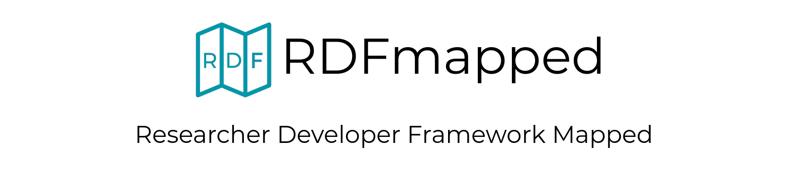

## About RDFmapped

### Researcher Development Framework Mapped

RDFmapped is based on a dataset which mapped [Vitae’s Researcher Development Framework](https://www.vitae.ac.uk/researchers-professional-development/about-the-vitae-researcher-development-framework/developing-the-vitae-researcher-development-framework "Vitae’s Researcher Development Framework") against LinkedIn Learning resources. This mapping was completed by LinkedIn Learning in collaboration with Vitae and was originally in spreadsheet form. The aim of the [rdfmapped.com](https://rdfmapped.com) website is to make this dataset accessible, searchable, and convenient for researchers.

## Tech specs

Some tech specs of rdfmapped.com project

- CI with Jest & [99%+ module coverage](https://dev.rdfmapped.com/coverage)
- HTTP Strict Transport Security [HSTS preloaded](https://hstspreload.org/?domain=rdfmapped.com "HSTS Preloaded")
- [Lightouse 95+](https://googlechrome.github.io/lighthouse/viewer/?psiurl=https%3A%2F%2Frdfmapped.com%2F&strategy=desktop&category=performance&category=accessibility&category=best-practices&category=seo&category=pwa&utm_source=lh-chrome-ext) for all tests
- automatically deployed [module documentation](https://dev.rdfmapped.com/docs)
- user authentication via Encrypted JWTs
- automatic updating of LinkedIn Learning API content
- eslint & Codacy metrics
- TLS v1.3, [A+ SSL Labs rating](https://www.ssllabs.com/ssltest/analyze.html?d=rdfmapped.com "Qualys SSL Labs Report")
- content served through HTTP/2 via brotli
- automatic issue creation by [@rdfbot](https://github.com/rdfbot) via GitHub API

## Supporting RDFmapped

RDFmapped is a free, open source project and therefore donations are greatly appreciated.

### Sponsors

Huge thanks to King's College London for sponsoring the initial development of the project.

### Support our development

#### Donations are welcome

Consider supporting us by a [one-time](https://github.com/sponsors/almasen?frequency=one-time) or recurring donation via [Github Sponsors](https://github.com/sponsors/almasen).

Your name will be featured in the list of our sponsors as per the GitHub sponsors description.

#### Sponsor the RDFmapped project

If you are interested in becoming on official sponsor of the RDFmapped project, please [contact us](https://rdfmapped.com/contact).

Your organisation/company name & logo will be featured on the rdfmapped.com website as well as the project readme based on your chosen support tier.

## Contribute

We warmly welcome all kinds of contributions from the tiniest UI tweaks through creating and/or fixing bug reports to expanding our collection of featured LinkedIn Learning courses & videos.

### Contributing code

If you are interested in contributing code, first, please have look at the [open issues](https://github.com/almasen/rdf-mapped/issues) (if there are any) and the [planned features](#planned-features) below. That said, if you would prefer to work on your own idea that's different from the planned upgrades, feel free to [create your own feature request issue](https://github.com/almasen/rdf-mapped/issues/new?assignees=&labels=&template=feature_request.md&title=).

Seriously, if you want to just change the padding of a div on a page, that's also fine! It will make me happy...especially since I'm not a frontend dev. But, if you would be kind enough to work on some of the planned extensions, that would be straight up amazing.

#### Planned features

Here are some of the main planned upgrades:

- [x] automatic GitHub issue creation
- [ ] public API with OAuth 2.0
- [x] dev subdomain & subpages
- [ ] submission of multiple courses/videos
- [ ] improve "similar courses/videos" algorithm
- [ ] bulk upload of CSV & JSON datasets (admin)
- [ ] refactor auth & logic of admin routes
- [ ] a pretty page for supporters
- [ ] a page about elephants

These are in no particular order (elephant page first plz) and again, any contributions are welcome!

If you are interested in working on one of the above mentioned planned features, please refer to the [kanban board](https://github.com/almasen/rdf-mapped/projects/1).

#### Building

For local development and information on how to build, please refer to the [Server Readme](./server/README.md).

#### Branch protection rules

As noted several times, all types of contributions are welcome. The only restriction is that all automatic tests need to pass for a PR to be merged. This includes Jest tests, eslint, some further code quality metrics and please sign your commits.

##### PR requirements

- backend build
- module & repository tests
- signed commits
- Codacy review

### Contributing content

The RDFmapped project is built on a valuable dataset that has been compiled by our hard working volunteers. Our core value is the RDF database which we aim to continuously maintain and expand.

Therefore, we warmly welcome all types of content contributions be that a single LinkedIn Learning course/video that you think could be helpful for researchers or a mapped whole [learning classification](https://docs.microsoft.com/en-us/linkedin/learning/reference/learningclassifications).

To thank you for your help, your name will be featured among our contributors (if you wish to disclose it) on the RDFmapped website based on the number of learning objects you have submitted.

If you would like to learn more about how you can help us expand our dataset, please [contact us](https://rdfmapped.com/contact).

#### Submit a dataset

If you are interested in contributing data and have a dataset that you would like to submit for us to review, please use the [contact form](https://rdfmapped.com/contact) on the official website and select the "Dataset to be imported" option as your reason.

#### Submit a single course/video

For submitting a single LinkedIn Learning course or video, please use the [Learning Object submission form](https://rdfmapped.com/submit).

If you would like to submit more than one, please submit the above form once for each course/video.

[We plan to expand this feature soon](#planned-features) so that you can submit multiple courses & videos via the form.

### Reporting a vulnerability

For security related issues, such as reporting a vulnerability, please consult the [security policy](https://github.com/almasen/rdf-mapped/security/policy).

## Credits

Huge thanks to the [Centre for Doctoral Studies, King's College London](https://www.kcl.ac.uk/doctoralstudies "KCL Doctoral Studies") for open sourcing RDFmapped and for the awesome opportunity to work on this project.

Credits to Vitae for the initial dataset of mapped LinkedIn Learning courses & videos. TODO: credit pending for specific team/group of people

Kudos to [@StenAL](https://github.com/StenAL), [@paumue](https://github.com/paumue), [@finwarman](https://github.com/finwarman), [@a-vorontsov](https://github.com/a-vorontsov) & [@houssam966](https://github.com/houssam966) for allowing me to use part of the backend code we have had written for our second year undergraduate project at KCL.

## Contact

For development related queries, issue creation is our preferred way of being contacted. If your query contains PII or any other sensitive information, please email us at the address on our profiles.

With any other questions, please refer to the [contact form](https://rdfmapped.com/contact) on the rdfmapped.com website.
