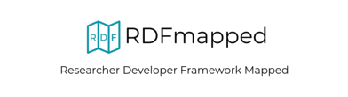

## About RDFmapped

### Researcher Development Framework Mapped

RDFmapped is based on a dataset which mapped [Vitae’s Researcher Development Framework](https://www.vitae.ac.uk/researchers-professional-development/about-the-vitae-researcher-development-framework/developing-the-vitae-researcher-development-framework "Vitae’s Researcher Development Framework") against LinkedIn Learning resources. This mapping was completed by LinkedIn Learning in collaboration with Vitae* (credit pending). This original mapping was in spreadsheet form. The aim of the rdfmapped.com website is to make this dataset accessible, searchable, and convenient for researchers.

## Contributing
